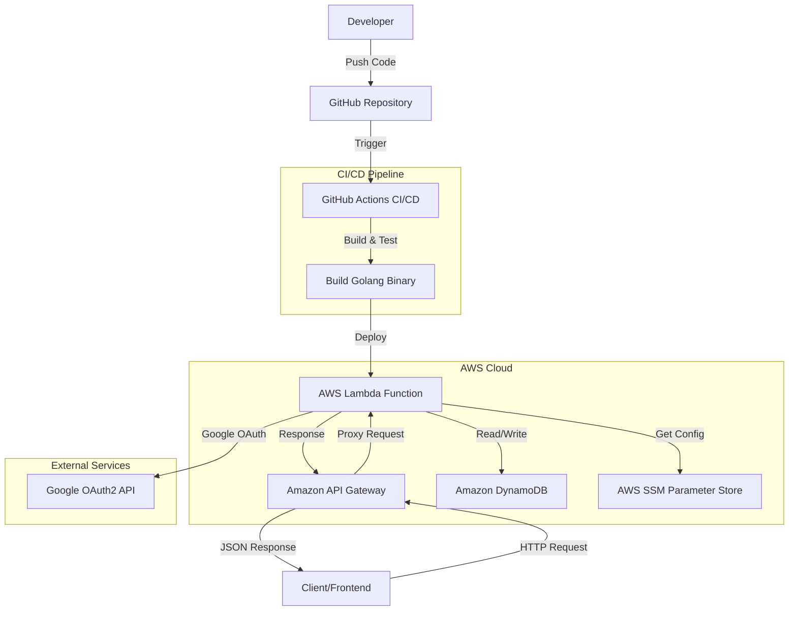

# Introduce
This project is a website backend  
[website fronted code](https://github.com/Cindle0826/growlabtech-frontend)

## Architecture Flow



## Prequest
因功能採用 Google 登入，需要預先申請 Google OAuth2

## Must Environment Parameter
```shell

    # look at the config.yaml
    ${google_client_id}=xxxx
    ${google_client_secret}=xxxx
    
```

## Technology Stack
- Golang
  - Gin (web framework)
  - Viper (config library)
  - zap (logging library)
- AWS
  - lambda (Amazon Linux 2)
  - API Gateway (HTTP V2)
  - SSM (System Manager Parameter Store)
  - DynamoDB (RCU: 1、 WCU: 1、 TTL: enable)

## Function
- signin: [預設 Google 登入(code)](api/service/authorize_service.go)
- Lambda: [Lambda 結合 Gin(code)](main.go)
- env params: 
  - [環境變數(config file)](settings/env/config.yaml)
  - [環境變數獲取 結合 viper(code)](settings/env/config.go)
- logging: [日誌收集與配置 zap(code)](settings/log/log_config.go)
- session Management: [session 管理(code)](api/service/session_service.go)
- DynamoDB connect: [DynamoDB 的連接與配置](api/database/dynamodb.go)
- CI / CD: [自動化測試/部署配置(code)](.github/workflows/deploy.yaml)
